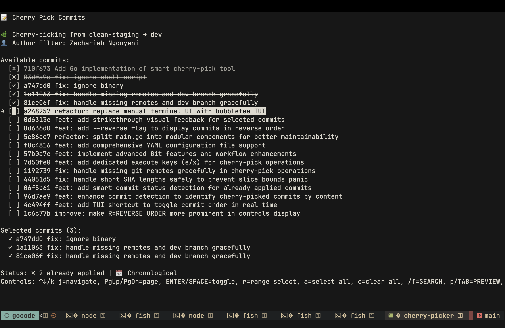

# 🍒 Cherry Picker

An interactive terminal-based Git cherry-pick tool that makes selectively applying commits between branches intuitive and efficient.



## ✨ Features

### 🎯 Smart Commit Detection
- Automatically identifies unique commits in your current branch vs a source branch
- Filters commits by author to show only your contributions
- Detects merge commits and already-applied commits
- Shows detailed commit metadata (date, author, files changed, insertions/deletions)

### 🖱️ Interactive Selection
- **Individual selection**: Use `Space` or `Enter` to toggle commit selection
- **Range selection**: Press `r` to select multiple consecutive commits
- **Bulk operations**: `a` to select all, `c` to clear all selections
- Visual indicators for selected (✓), merge (🔀), and already-applied (✗) commits

### 🔍 Advanced Search & Filtering
- **Fuzzy search**: Press `/` or `f` to search through commits
- Search across commit messages, SHA hashes, author names, and changed files
- Real-time filtering with live search results
- Navigate search results with arrow keys

### 👁️ Detailed Commit Preview
- Press `p` or `Tab` to enter preview mode
- View full commit diffs with syntax highlighting
- See detailed statistics (insertions/deletions by file)
- Examine commit metadata and file changes
- Truncated diff view for large commits

### 🌿 Dynamic Branch Management
- **Source branch switching**: Press `B` to change the comparison branch
- **Target branch switching**: Press `b` to change the destination branch
- Lists available local and remote branches
- Automatically reloads commits when branches change

### ⚔️ Comprehensive Conflict Resolution
- Built-in conflict detection during cherry-pick operations
- Interactive conflict resolution interface
- Multiple resolution strategies per file:
  - Use "ours" version
  - Use "theirs" version
  - Open merge tool
  - Manual editing
- Visual conflict status indicators

### 🔧 Multiple Execution Modes
- **Cherry-pick mode** (`e`/`x`): Standard cherry-pick selected commits
- **Interactive rebase mode** (`i`): Launch Git's interactive rebase
- Automatic conflict handling with user guidance

## 🚀 Installation

### Prerequisites
- Go 1.23.0 or later
- Git (installed and configured)

### Build from Source
```bash
git clone https://github.com/zechtz/cherry-picker.git
cd cherry-picker
go build -o cherry-picker
```

### Install Binary
```bash
# Move to a directory in your PATH
sudo mv cherry-picker /usr/local/bin/
```

## 🎮 Usage

### Basic Usage
```bash
# Run in any git repository
cherry-picker

# Start with commits in reverse order
cherry-picker --reverse

# Generate default configuration file
cherry-picker --generate-config
```

### Workflow Example
1. Navigate to your feature branch
2. Run `cherry-picker`
3. Select commits using `Space` or `Enter`
4. Use `/` to search for specific commits
5. Press `e` to execute cherry-pick
6. Handle any conflicts in the resolution interface

## ⌨️ Keyboard Shortcuts

### Navigation
| Key | Action |
|-----|--------|
| `↑/↓` or `j/k` | Move cursor up/down |
| `Page Up/Down` | Jump by page |
| `Home/End` | Go to first/last commit |

### Selection
| Key | Action |
|-----|--------|
| `Space/Enter` | Toggle commit selection |
| `r` | Toggle range selection mode |
| `a` | Select all commits |
| `c` | Clear all selections |

### Views & Modes
| Key | Action |
|-----|--------|
| `d` | Toggle detail view |
| `p/Tab` | Toggle preview mode |
| `/` or `f` | Enter search mode |
| `R` | Reverse commit order |

### Branch Management
| Key | Action |
|-----|--------|
| `b` | Switch target branch |
| `B` | Switch source branch |

### Execution
| Key | Action |
|-----|--------|
| `e/x` | Execute cherry-pick |
| `i` | Interactive rebase mode |
| `q/Ctrl+C` | Quit |

### Search Mode
| Key | Action |
|-----|--------|
| `Type` | Filter commits |
| `Enter` | Exit search mode |
| `Esc` | Clear search and exit |

## ⚙️ Configuration

Cherry Picker uses a YAML configuration file located at `~/.cherry-picker.yaml`.

### Generate Default Config
```bash
cherry-picker --generate-config
```

### Configuration Options

```yaml
git:
  # Default target branch for cherry-picking
  target_branch: "clean-staging"
  
  # Default source branch to compare against
  source_branch: "dev"
  
  # Remote name
  remote: "origin"
  
  # Automatically fetch remote before operations
  auto_fetch: true
  
  # Branches where the tool should not run
  excluded_branches:
    - "main"
    - "master"
    - "production"

ui:
  # Cursor blink interval in milliseconds
  cursor_blink_interval: 500
  
  # Show commit date in the list
  show_commit_date: false
  
  # Show commit author in the list
  show_commit_author: false
  
  # Maximum number of commits to display
  max_commits: 100

behavior:
  # Start in reverse order by default
  default_reverse: false
  
  # Require confirmation before executing
  require_confirmation: true
  
  # Automatically push after successful cherry-pick
  auto_push: false
```

## 🛠️ Development

### Project Structure
```
├── main.go          # Entry point and CLI flag handling
├── models.go        # Data structures and core logic
├── tui.go          # Bubbletea UI implementation
├── git.go          # Git operations and command execution
├── config.go       # Configuration management
├── app.go          # Application setup and initialization
└── smart-cherry-pick.sh  # Legacy shell script reference
```

### Dependencies
- [Bubbletea](https://github.com/charmbracelet/bubbletea) - Terminal UI framework
- [Lipgloss](https://github.com/charmbracelet/lipgloss) - Style and layout
- [YAML v3](https://gopkg.in/yaml.v3) - Configuration parsing

### Building
```bash
go mod tidy
go build -o cherry-picker
```

### Testing
```bash
go test ./...
```

## 🤝 Contributing

1. Fork the repository
2. Create a feature branch (`git checkout -b feature/amazing-feature`)
3. Commit your changes (`git commit -m 'Add amazing feature'`)
4. Push to the branch (`git push origin feature/amazing-feature`)
5. Open a Pull Request

## 📝 License

This project is licensed under the MIT License - see the LICENSE file for details.

## 🙏 Acknowledgments

- Built with [Charm](https://charm.sh/) TUI libraries
- Inspired by the need for better Git cherry-pick workflows
- Thanks to the Go community for excellent tooling

---

**Happy cherry-picking! 🍒**